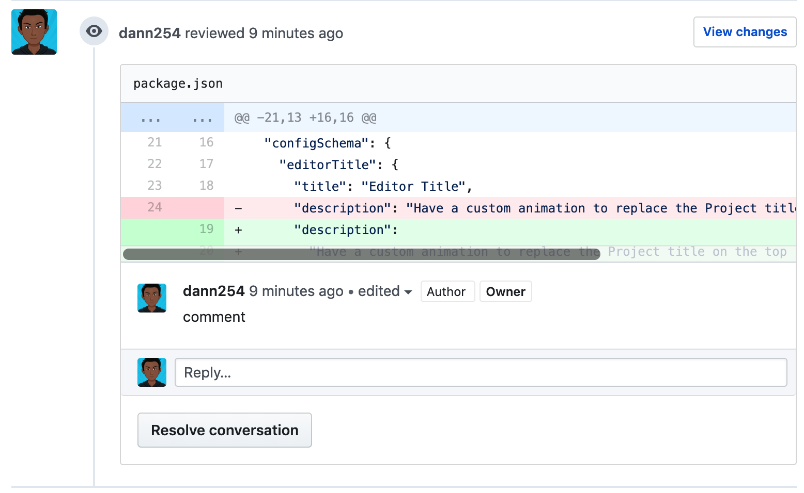
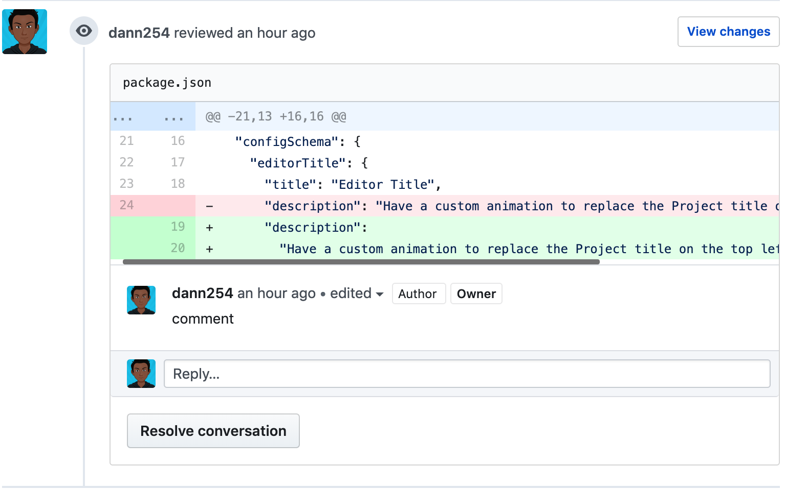

### Chrome extension for github

This chrome extension fixes the bottom scrollbar blocking the last line of reviewed code on github pull requests.

> [Find it on chrome webstore](https://chrome.google.com/webstore/detail/octoscroll/hbgpoggeobapeimepldaedkeblffcdbi)

Have a sample of the annoyance:

I know what you are gonna say..

"But MacOs auto hides scrollbars by default 🙄"

Well who is this MacOs you speak of?...... 😂 😂 😂 😂 😂 😂

Sometimes it doesn't work and it gets more annoying every time you encounter it.

#### Are you waiting for superman?

It is I, the much anticipated hero here to add some styling.  

Here is how the fixed one looks like:

### Here is how to set up, or not, I don't know what you want to do. It's not like I can read minds or anything like that, or can I. 👀

- Clone this repo or download it, or copy every file one by one.
- Open chrome or switch to it if you had it Open
- Enter `chrome://extensions/` on a new tab or an old one.
- Click on `load unpacked` and look for this extension wherever you cloned it to. If you don't know where, you are wrapped helically around an inclined plane 🔩. Coz you have to clone it again or something.
- Once you are done, The extension should work every time you are on a github pull request.
- If you make a change on the extension you have to refresh it, every time 🔄.

*** Insert celebrating noises here ***

👀

*** Celebrating Noise intensify ***
